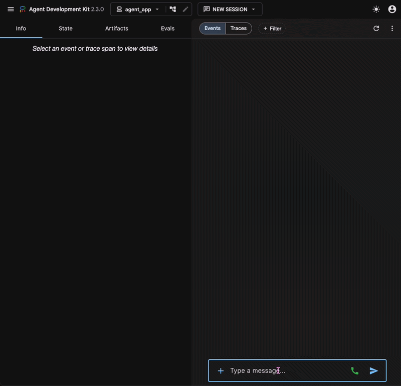
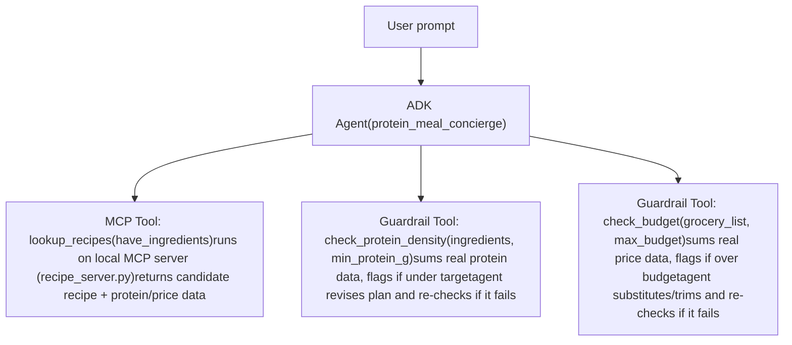

# Protein Meal Concierge

An AI-powered concierge agent that transforms the ingredients already in your kitchen into a protein-optimized meal plan 
and budget-conscious grocery list using verified tool calls—not AI guesses.— built for the 
*AI Agents: Intensive Vibe Coding* capstone (Concierge Agents track).

## Demo

Here’s a quick walkthrough of the Protein Meal Concierge in action:



## The Story 
The Story

Imagine you've just finished an intense lifting session. You're exhausted, hungry, and realize you completely forgot to meal prep for the week.

As you're driving home, you pass your favorite burger restaurant. The smell is incredible. You think, "A burger has protein...that's good enough, right?"

Maybe—but after adding fries, a drink, and the extra calories hidden in sauces and toppings, you've likely exceeded both your nutrition goals and your budget before even getting home.

Instead of making an impulse decision while tired and hungry, you open Protein Meal Concierge.

You tell it:

what ingredients you already have
how much protein you want to eat
your grocery budget

Within seconds, the agent recommends a meal built around what you already own, verifies that it actually meets your protein target, generates a grocery list containing only the missing ingredients, and ensures everything stays within your budget.

The goal isn't simply generating recipes.

The goal is helping users make healthier, smarter decisions when they're most likely to make poor ones.

## Problem

Traditional meal-planning applications focus on:

healthy eating
convenience
variety

Few actually optimize around measurable fitness goals like protein intake while also respecting a grocery budget.

People trying to build muscle or simply eat more protein often end up manually:

calculating macros
checking nutrition labels
comparing grocery prices
deciding what ingredients they still need

This process is repetitive, time-consuming, and easy to abandon when you're hungry.


## Solution

Protein Meal Concierge takes what you already have in your kitchen, plus an
optional budget, and:

1. Finds a protein-forward recipe built around your on-hand ingredients
2. Verifies the meal actually meets a protein target — and revises if it
   doesn't, rather than just asserting it does
3. Builds a grocery list of only the ingredients you're missing
4. Verifies that list fits your stated budget — and trims/substitutes if
   it doesn't

The key design goal: **the agent never just claims a number is correct — it
calls a tool to check.** Early in development, the agent (without proper
tool wiring) fabricated a plausible-sounding recipe with made-up protein and
price figures. The architecture below exists specifically to prevent that.

## How is this an AI Agent

Protein Meal Concierge demonstrates several characteristics of an AI agent rather than a simple chatbot.

✅ Reasons over multiple user constraints

✅ Uses external tools to gather information

✅ Validates intermediate results

✅ Revises its plan when constraints fail

✅ Returns only verified recommendations

Rather than producing a single response, the agent continuously reasons until all requirements have been satisfied.

## Architecture


**Why MCP for the recipe lookup specifically:** it keeps ingredient/nutrition
data as a separately runnable service rather than baked into the agent's own
code — the same pattern used for connecting an agent to any external data
source (a real nutrition API could swap in here with no agent-side changes).

**Why two guardrails instead of one combined check:** protein and budget are
independent constraints that can each fail on their own; keeping them as
separate tools makes the failure mode explicit in the trace (you can see
*which* constraint the agent is reacting to) rather than a single opaque
"is this plan okay?" check.

## Tech Stack

- **Google ADK** (`google-adk`) — agent framework, tool orchestration
- **Model Context Protocol** (`mcp`) — local recipe/nutrition lookup server
- **Gemini** (`gemini-2.5-flash` / `gemini-flash-latest`) — underlying LLM
- **Antigravity IDE/CLI** — used for local development and testing (see demo video)

## Repository Structure
protein-meal-ai-concierge/

├── agent_app/
├── recipe_server.py
├── requirements.txt
├── README.md
└── .env

## Setup

```bash
git clone https://github.com/victoriamacali/protein-meal-ai-concierge.git
cd protein-meal-ai-concierge

python3 -m venv .venv
source .venv/bin/activate       # Windows: .venv\Scripts\activate

pip install -r requirements.txt
```

Create a `.env` file in the project root with your Gemini API key
(get one at https://aistudio.google.com/app/apikey):
GOOGLE_API_KEY=your_key_here

Run the agent:
```bash
adk run agent_app
```
or, for a visual trace of tool calls:
```bash
adk web agent_app
```

## Example interaction
[user]: I have pasta and ground beef, I want a meal with 25-35 grams of
protein, keep extra ingredients under $15
[protein_meal_concierge]: Recipe: Beef & Pasta Skillet
Total protein: 41g (target: 25-35g ✓)
Grocery list (missing ingredients only):

Parmesan: $0.80
Total cost: $0.80 (within $15.00 budget)

## Lessons Learned
Lessons Learned

During early development, the language model confidently generated plausible-looking protein totals 
and grocery prices without evidence.

This project reinforced an important principle of agent engineering:

Language models are excellent reasoning engines, but factual claims should be verified through external tools whenever possible.

That realization directly motivated the verification-first architecture used throughout this project.

## Security / Guardrails

- The agent is instructed to **never fabricate** nutrition or price data —
  all numbers must come from tool calls, not the LLM's own estimate
- `check_protein_density` and `check_budget` act as hard verification steps
  the agent must pass before presenting a final plan
- API keys are kept in `.env`, excluded from version control via `.gitignore`

## Known limitations / Future Work

_ Does not currently optimize calories, carbohydrates, or fats.
- Ingredient/nutrition data is a small static lookup table for demo purposes
  — a production version would call a real nutrition API via the same MCP
  interface with no agent-side changes needed
- No persistent memory of user preferences across sessions (yet) — each
  session starts fresh
- No live deployment; runs locally via Antigravity/ADK CLI
- USDA FoodData Central integration
- Multi-day meal planning
- Barcode scanning

## Track

Concierge Agents — automating a daily personal task (deciding what to eat
and what to buy) using tool-verified, constraint-driven agent reasoning.

Protein Meal Concierge demonstrates how AI agents can move beyond conversation by combining reasoning, external tools, and verification to help users make healthier, budget-conscious decisions with confidence.
